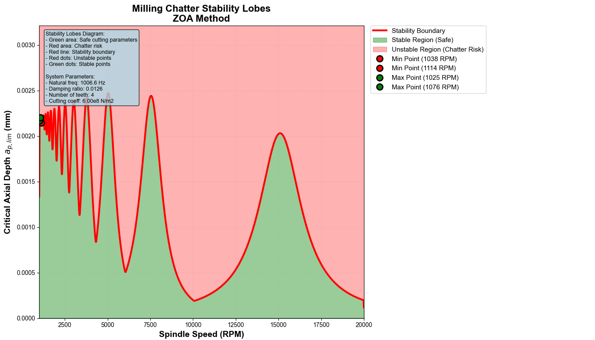

# rtim
Real Time Intelligent Machining of Conjugate Mapping of Streamline Fields（基于流线场共扼映射的实时智能加工平台）

# 1. Development
## 1.1. ZOA
使用development/phase01/zoa.py程序：
```bash
======================================================================
Milling Chatter Stability Analysis - ZOA Method
======================================================================
System Parameters:
  - Modal mass: m = 0.5 kg
  - Stiffness: k = 20.0 x 10^6 N/m
  - Damping: c = 80.0 N·s/m
  - Natural frequency: f_n = 1006.6 Hz
  - Damping ratio: ζ = 0.0126
  - Number of teeth: N = 4
  - Cutting coefficient: Kt = 6.00 x 10^8 N/m^2
  - Radial force ratio: Kr = 0.3

Speed range: 1000 - 20000 RPM
Data points: 1500

Calculating stability lobes...
Successfully plotted 1500 data points
```


## 1.2. 开发 OCCT 几何特征提取模块（C++）
### 1.2.1. 开发环境搭建
```bash
# 1. 更新系统并安装基础依赖
sudo apt update
sudo apt install build-essential cmake git libx11-dev libxext-dev \
                 libxrender-dev libxmu-dev libxmuu-dev libfreetype6-dev \
                 libgl1-mesa-dev libfreeimage-dev libtbb-dev libglu1-mesa-dev

# 2. 安装Open CASCADE Technology (OCCT)
# 方法一：从官方仓库安装（推荐）
sudo add-apt-repository ppa:freecad-maintainers/freecad-stable
sudo apt update
sudo apt install libopencascade-dev

# 方法二：从源码编译（获取最新版本）
cd ~
git clone https://github.com/Open-Cascade-SAS/OCCT.git
cd OCCT
git checkout V7_9_3
mkdir build && cd build
# 安装依赖库
sudo apt install libvtk9-dev
sudo apt-get install -y \
  libfreeimage-dev \
  libtiff-dev \
  libfreetype6-dev \
  libgl1-mesa-dev \
  libx11-dev \
  libxmu-dev \
  libxi-dev \
  libglu1-mesa-dev \
  libglew-dev

  cmake .. \
    -DCMAKE_INSTALL_PREFIX=/home/yantao/opencascade \
    -DCMAKE_BUILD_TYPE=Release \
    -DBUILD_LIBRARY_TYPE=Shared \
    -DBUILD_MODULE_ApplicationFramework=ON \
    -DBUILD_MODULE_DataExchange=ON \
    -DBUILD_MODULE_ModelingData=ON \
    -DBUILD_MODULE_ModelingAlgorithms=ON \
    -DBUILD_MODULE_Visualization=ON \
    -DUSE_FREEIMAGE=ON \
    -DUSE_FREETYPE=ON \
    -DUSE_VTK=ON \
    -DUSE_OPENGL=ON

make -j$(nproc)
make install

mkdir /home/yantao/opencascade/lib/pkgconfig
vim /home/yantao/opencascade/lib/pkgconfig/opencascade.pc
#################################################################################################
# 文件内容
#################################################################################################
prefix=/home/yantao/opencascade
exec_prefix=${prefix}
libdir=${exec_prefix}/lib
includedir=${prefix}/include/opencascade

Name: OpenCASCADE
Description: Open CASCADE Technology, 3D modeling & numerical simulation
Version: 7.9.3
Requires:
Libs: -L${libdir} -lTKernel -lTKMath -lTKBRep -lTKTopAlgo -lTKPrim -lTKBool -lTKShHealing -lTKMesh -lTKXSBase -lTKG2d -lTKG3d -lTKGeomBase -lTKGeomAlgo -lTKFillet -lTKOffset -lTKFeat  -lTKService -lTKHLR -lTKBO -lTKCAF -lTKCDF -lTKLCAF -lTKTObj -lTKVCAF -lTKXmlXCAF -lTKRWMesh   -lTKMeshVS -lTKV3d -lTKViewerTest -lTKIVtk -lTKQADraw -lTKTObjDRAW -lTKDraw -lTKTopTest -lTKXSDRAW -lTKDCAF -lTKStdL -lTKStd -lTKBinL -lTKBin -lTKXmlL -lTKXml -lTKBinTObj -lTKXmlTObj -lTKBinXCAF -lTKXmlXCAF -lTKOpenGlTest
Cflags: -I${includedir} -DHAVE_CONFIG_H
########################################################################################################
# 编辑 ~/.bashrc（如果使用 bash）
echo 'export PKG_CONFIG_PATH=/home/yantao/opencascade/lib/pkgconfig:$PKG_CONFIG_PATH' >> ~/.bashrc
echo 'export LD_LIBRARY_PATH=/home/yantao/opencascade/lib:$LD_LIBRARY_PATH' >> ~/.bashrc
# 使配置生效
source ~/.bashrc

# 3. 验证OCCT安装
pkg-config --modversion opencascade
# 显示7.9.3即为正确安装
```

设置git代理
```bash
git config http.proxy http://127.0.0.1:7897
git config https.proxy http://127.0.0.1:7897
# 取消设置
git config --unset http.proxy
git config --unset https.proxy

# ssh代理
#编辑 ~/.ssh/config 文件，添加以下内容：
Host github.com
User git
ProxyCommand connect -S 127.0.0.1:1080 %h %p
```

### 1.2.2. 生成自由曲面
#### 1.2.2.1. Python生成
先安装OpenCASCADE的Python开发库：
```bash
sudo apt install swig
git clone https://github.com/tpaviot/pythonocc-core.git
cd pythonocc-core
git checkout -b 7.9.3  # 或具体 tag，如 git checkout 7.8.0
export CASROOT=/home/yantao/opencascade    # 替换为你的实际 OCCT 安装路径
export LD_LIBRARY_PATH=$CASROOT/lib:$LD_LIBRARY_PATH
#
conda activate samt
pip install cmake numpy
# 编译并安装 pythonocc-core（关键：指定 OCCT 路径）
python setup.py build_ext --rpath=$CASROOT/lib

# 源码安装特定版本swig
sudo apt-get install -y \
    wget \
    libglu1-mesa-dev \
    libgl1-mesa-dev \
    libxmu-dev \
    libxi-dev \
    build-essential \
    cmake \
    libfreetype6-dev \
    tk-dev \
    python3-dev \
    rapidjson-dev \
    python3 \
    git \
    python3-pip \
    libpcre2-dev

wget http://prdownloads.sourceforge.net/swig/swig-4.3.0.tar.gz
tar -zxvf swig-4.3.0.tar.gz
cd swig-4.3.0
./configure
make -j$(nproc)
sudo make install

# 向系统添加OpenCASCADE
sudo bash -c 'echo "/home/yantao/opencascade/lib" >> /etc/ld.so.conf.d/occt.conf'
sudo ldconfig

# 编译pythonocc-core
PYTHONOCC_INSTALL_DIRECTORY=${PYTHONOCC_INSTALL_DIRECTORY:-/usr/local}
cmake \
    -DOCCT_INCLUDE_DIR=/home/yantao/opencascade/include/opencascade \
    -DOCCT_LIBRARY_DIR=/home/yantao/opencascade/lib \
    -DCMAKE_BUILD_TYPE=Release \
    -DPYTHONOCC_INSTALL_DIRECTORY=$PYTHONOCC_INSTALL_DIRECTORY \
    ..


cmake .. \
  -DPYTHON_EXECUTABLE=$(which python) \
  -DPYTHON_INCLUDE_DIR=$(python -c "from sysconfig import get_paths as g; print(g()['include'])") \
  -DPYTHON_LIBRARY=$(python -c "import sysconfig; print(sysconfig.get_config_var('LIBDIR') + '/libpython' + sysconfig.get_python_version() + '.so')") \
  -DNUMPY_INCLUDE_DIR="$NUMPY_INCLUDE" \
  -DOpenCASCADE_DIR=$CASROOT/lib/cmake/opencascade \
  -DCMAKE_BUILD_TYPE=Release


make -j$(nproc) && sudo make install
```

#### 1.2.2.2. Cpp生成
在编译完成后，运行：vim /home/yantao/opencascade/lib/cmake/opencascade/OpenCASCADEVisualizationTargets.cmake 在Ln88行，去掉对TKIVtk库的引用。可以直接make，然后生成双曲面。该双曲面可以由freecad软件打开并正常显示。
